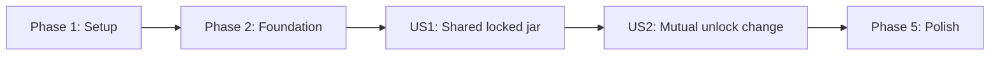

# Tasks: Shared Locked Jar

**Input**: Design documents from `C:\workspace\good-thing-jar\good-thing-jar-spec\specs\001-shared-locked-jar\`
**Implementation Root**: `C:\workspace\good-thing-jar\good-thing-jar-backend`
**Prerequisites**: plan.md, spec.md, research.md, data-model.md, contracts/openapi.yaml, quickstart.md

**Tests**: Automated tests are required because the specification defines security, concurrency,
time-boundary, persistence, and performance acceptance criteria. Tests verify behavior rather than
implementation details.

**Organization**: Tasks are grouped by user story. Every implementation path targets the backend
repository; specification artifacts remain in the specification repository.

## Format: `[ID] [P?] [Story] Description`

- **[P]**: Can run in parallel after its stated prerequisites because it changes different files.
- **[Story]**: Maps the task to User Story 1 or User Story 2.
- Paths are absolute to prevent commands or implementation work from targeting the specification
  repository.

## Phase 1: Setup

**Purpose**: Align the reinitialized Spring Boot project with the approved build and package layout.

- [X] T001 Move the generated launcher and context test into the authoritative `com.goodthingjar` package at `C:\workspace\good-thing-jar\good-thing-jar-backend\src\main\java\com\goodthingjar\GoodThingJarBackendApplication.java` and `C:\workspace\good-thing-jar\good-thing-jar-backend\src\test\java\com\goodthingjar\GoodThingJarBackendApplicationTests.java`
- [X] T002 [P] Add Spring Security, Data JPA, Validation, Mail, Actuator, Flyway, PostgreSQL, Spring Modulith, Testcontainers PostgreSQL, Spring Security Test, and Modulith test dependencies while preserving `com.goodthingjar:good-thing-jar-backend:0.0.1-SNAPSHOT`, Java 21, and Spring Boot 4.1.1 in `C:\workspace\good-thing-jar\good-thing-jar-backend\pom.xml`
- [X] T003 [P] Define environment-driven datasource, Flyway, mail, actuator, JPA schema-validation, keyed throttle-scope secret, environment- or secret-manager-provided verification-delivery encryption key, and separate capacity/window settings for authentication, verification-resend, invitation-create, invitation-retry, and entry-write throttles in `C:\workspace\good-thing-jar\good-thing-jar-backend\src\main\resources\application.properties`, `C:\workspace\good-thing-jar\good-thing-jar-backend\src\main\resources\application-local.properties`, and `C:\workspace\good-thing-jar\good-thing-jar-backend\src\test\resources\application-test.properties`
- [X] T004 [P] Add local PostgreSQL and Mailpit services with health checks and environment-variable configuration in `C:\workspace\good-thing-jar\good-thing-jar-backend\compose.yaml`
- [X] T005 [P] Create the approved `com.goodthingjar.identity`, `com.goodthingjar.pairing`, `com.goodthingjar.jar`, `com.goodthingjar.notification`, and `com.goodthingjar.platform` module roots and their Spring Modulith descriptors in `C:\workspace\good-thing-jar\good-thing-jar-backend\src\main\java\com\goodthingjar\identity\package-info.java`, `C:\workspace\good-thing-jar\good-thing-jar-backend\src\main\java\com\goodthingjar\pairing\package-info.java`, `C:\workspace\good-thing-jar\good-thing-jar-backend\src\main\java\com\goodthingjar\jar\package-info.java`, `C:\workspace\good-thing-jar\good-thing-jar-backend\src\main\java\com\goodthingjar\notification\package-info.java`, and `C:\workspace\good-thing-jar\good-thing-jar-backend\src\main\java\com\goodthingjar\platform\package-info.java`
- [X] T006 Configure the backend Maven build to validate the sibling OpenAPI source at `C:\workspace\good-thing-jar\good-thing-jar-spec\specs\001-shared-locked-jar\contracts\openapi.yaml` without copying generated sources into the specification repository in `C:\workspace\good-thing-jar\good-thing-jar-backend\pom.xml`

**Checkpoint**: The backend builds from its own Maven Wrapper and uses the authoritative package and
repository boundaries.

---

## Phase 2: Foundational Infrastructure

**Purpose**: Implement authentication, shared persistence, time, errors, notification delivery, and
module enforcement required by every user story.

**Critical**: No user story implementation begins until this phase is complete.

- [X] T007 Create the identity schema for accounts, 24-hour email verifications with supersession and one-unsuperseded-token-per-account enforcement, and revocable authentication sessions with required unique constraints and indexes in `C:\workspace\good-thing-jar\good-thing-jar-backend\src\main\resources\db\migration\V001__identity_and_sessions.sql`
- [X] T008 Create the PostgreSQL outbox, security audit, and shared fixed-window abuse-throttle bucket schema with atomic-counter and cleanup indexes in `C:\workspace\good-thing-jar\good-thing-jar-backend\src\main\resources\db\migration\V002__outbox_and_security_audit.sql`
- [X] T009 [P] Provide the trusted injectable `Clock` and time-zone conversion helpers in `C:\workspace\good-thing-jar\good-thing-jar-backend\src\main\java\com\goodthingjar\platform\time\TimeConfiguration.java` and `C:\workspace\good-thing-jar\good-thing-jar-backend\src\main\java\com\goodthingjar\platform\time\TimeZoneRules.java`
- [X] T010 [P] Implement centralized validation, RFC 9457-style safe problem responses, and the reusable retryable throttle problem with a whole-second `Retry-After` header in `C:\workspace\good-thing-jar\good-thing-jar-backend\src\main\java\com\goodthingjar\platform\error\ApiExceptionHandler.java` and `C:\workspace\good-thing-jar\good-thing-jar-backend\src\main\java\com\goodthingjar\platform\error\ProblemCode.java`
- [X] T011 [P] Map Account and EmailVerification as internal lazy JPA persistence models with account-locking, token-hash, expiry, consumption, and supersession queries in `C:\workspace\good-thing-jar\good-thing-jar-backend\src\main\java\com\goodthingjar\identity\persistence\AccountEntity.java`, `C:\workspace\good-thing-jar\good-thing-jar-backend\src\main\java\com\goodthingjar\identity\persistence\EmailVerificationEntity.java`, `C:\workspace\good-thing-jar\good-thing-jar-backend\src\main\java\com\goodthingjar\identity\persistence\AccountRepository.java`, and `C:\workspace\good-thing-jar\good-thing-jar-backend\src\main\java\com\goodthingjar\identity\persistence\EmailVerificationRepository.java`
- [X] T012 [P] Map AuthSession with hashed tokens, refresh rotation state, revocation, and locking queries in `C:\workspace\good-thing-jar\good-thing-jar-backend\src\main\java\com\goodthingjar\identity\persistence\AuthSessionEntity.java` and `C:\workspace\good-thing-jar\good-thing-jar-backend\src\main\java\com\goodthingjar\identity\persistence\AuthSessionRepository.java`
- [X] T013 [P] Map OutboxMessage, SecurityAuditEvent, and AbuseThrottleBucket with claim, retry, append-only audit, atomic throttle increment, and cleanup persistence operations in `C:\workspace\good-thing-jar\good-thing-jar-backend\src\main\java\com\goodthingjar\notification\persistence\OutboxMessageEntity.java`, `C:\workspace\good-thing-jar\good-thing-jar-backend\src\main\java\com\goodthingjar\notification\persistence\OutboxMessageRepository.java`, `C:\workspace\good-thing-jar\good-thing-jar-backend\src\main\java\com\goodthingjar\platform\observability\SecurityAuditEventEntity.java`, `C:\workspace\good-thing-jar\good-thing-jar-backend\src\main\java\com\goodthingjar\platform\observability\SecurityAuditRepository.java`, `C:\workspace\good-thing-jar\good-thing-jar-backend\src\main\java\com\goodthingjar\platform\observability\SecurityAuditService.java`, `C:\workspace\good-thing-jar\good-thing-jar-backend\src\main\java\com\goodthingjar\platform\throttle\AbuseThrottleBucketEntity.java`, and `C:\workspace\good-thing-jar\good-thing-jar-backend\src\main\java\com\goodthingjar\platform\throttle\AbuseThrottleBucketRepository.java`
- [X] T014 Implement adaptive password hashing, random opaque token generation and hashing, bearer authentication, immediate revocation checks, and the PostgreSQL-backed operation-specific throttle service using keyed pseudonymous scopes and trusted-clock retry delays in `C:\workspace\good-thing-jar\good-thing-jar-backend\src\main\java\com\goodthingjar\platform\security\SecurityConfiguration.java`, `C:\workspace\good-thing-jar\good-thing-jar-backend\src\main\java\com\goodthingjar\platform\security\OpaqueTokenAuthenticationFilter.java`, `C:\workspace\good-thing-jar\good-thing-jar-backend\src\main\java\com\goodthingjar\platform\security\SecretHasher.java`, `C:\workspace\good-thing-jar\good-thing-jar-backend\src\main\java\com\goodthingjar\platform\throttle\AbuseThrottleService.java`, and `C:\workspace\good-thing-jar\good-thing-jar-backend\src\main\java\com\goodthingjar\platform\throttle\ThrottleProperties.java`
- [X] T015 Implement atomic registration, 24-hour email verification, and throttled privacy-preserving verification resend so eligible resends lock the account, supersede every prior unsuperseded token including expired tokens, store only the new token hash, encrypt the delivery secret before outbox persistence, queue one delivery, and never change invitation expiry in `C:\workspace\good-thing-jar\good-thing-jar-backend\src\main\java\com\goodthingjar\identity\application\RegistrationService.java` and `C:\workspace\good-thing-jar\good-thing-jar-backend\src\main\java\com\goodthingjar\identity\application\EmailVerificationService.java`
- [X] T016 Implement throttled session creation and refresh plus rotation, reuse detection, and logout revocation transactions in `C:\workspace\good-thing-jar\good-thing-jar-backend\src\main\java\com\goodthingjar\identity\application\SessionService.java`
- [X] T017 Expose `POST /auth/registrations`, `POST /auth/email-verifications`, `POST /auth/email-verification-resends`, `POST /auth/sessions`, `POST /auth/sessions/refresh`, and `DELETE /auth/sessions/current` with generic resend DTOs, operation-specific throttling, and no persistence entities in `C:\workspace\good-thing-jar\good-thing-jar-backend\src\main\java\com\goodthingjar\identity\api\AuthenticationController.java` and `C:\workspace\good-thing-jar\good-thing-jar-backend\src\main\java\com\goodthingjar\identity\api\AuthenticationDtos.java`
- [X] T018 Implement bounded crash-safe outbox claiming, SMTP delivery, and terminal result dispatch for invitation and verification email; decrypt a verification delivery secret only inside the mail-delivery path, include it only in the intended account-owner message, clear the encrypted secret after terminal processing, do not automatically reschedule an invitation attempt after it produces `DELIVERY_FAILED`, and never log secrets or raw email addresses in `C:\workspace\good-thing-jar\good-thing-jar-backend\src\main\java\com\goodthingjar\notification\application\OutboxDispatcher.java` and `C:\workspace\good-thing-jar\good-thing-jar-backend\src\main\java\com\goodthingjar\notification\infrastructure\SmtpMailGateway.java`
- [X] T019 [P] Verify all Flyway migrations against clean PostgreSQL and schema validation in `C:\workspace\good-thing-jar\good-thing-jar-backend\src\test\java\com\goodthingjar\integration\FlywayMigrationIntegrationTest.java`
- [X] T020 Verify registration, exact 24-hour verification expiry, replacement superseding expired and unexpired unsuperseded tokens, generic resend for absent/unverified/verified email, concurrent resend leaving one newest usable token, reliable verification outbox delivery, authentication and resend throttling with `Retry-After`, opaque session rotation, token reuse, logout revocation, and sanitized storage/log failures in `C:\workspace\good-thing-jar\good-thing-jar-backend\src\test\java\com\goodthingjar\identity\AuthenticationIntegrationTest.java`
- [X] T021 Verify module cycles and access to internals are rejected in `C:\workspace\good-thing-jar\good-thing-jar-backend\src\test\java\com\goodthingjar\architecture\ModularityTest.java`

**Checkpoint**: Authentication, trusted time, database migrations, error handling, outbox delivery,
and module boundaries are operational and verified.

---

## Phase 3: User Story 1 - Share and Open a Private Jar (Priority: P1) MVP

**Goal**: Two verified users form one pair, write unlimited private entries, reveal them only at the
trusted unlock instant, and create exactly one next jar after reveal.

**Independent Test**: Register and verify two accounts, deliver and accept an invitation, submit
entries from both accounts, prove all pre-unlock reads and nonmember access reveal no entry metadata,
advance the trusted clock to the exact unlock instant, retrieve every entry, and concurrently request
the next jar while observing exactly one new locked jar.

### Tests for User Story 1

- [X] T022 [P] [US1] Define invitation API and PostgreSQL concurrency tests covering missing/invalid IANA zones; privacy-safe creation and retry throttling; verification resend leaving invitation expiry unchanged; exact seven-day expiry; duplicate sequential and concurrent creation; retry after expiry; delivery results after expiry or cancellation; cancellation from every active state; cancel versus accept, retry, and delivery result; provider handoff before cancellation; and creation after each terminal status in `C:\workspace\good-thing-jar\good-thing-jar-backend\src\test\java\com\goodthingjar\pairing\InvitationLifecycleApiTest.java`
- [X] T023 [P] [US1] Define concurrent invitation acceptance tests proving one-pair-per-account and invalidation of other incoming and outgoing invitations in `C:\workspace\good-thing-jar\good-thing-jar-backend\src\test\java\com\goodthingjar\pairing\PairingConcurrencyIntegrationTest.java`
- [X] T024 [P] [US1] Define controlled Clock tests for default year-end calculation, calendar-year rollover, daylight-saving transitions in the jar's fixed time zone, one-instant-before denial, exact-instant reveal, post-unlock write denial, and boundary writes in `C:\workspace\good-thing-jar\good-thing-jar-backend\src\test\java\com\goodthingjar\jar\JarLockBoundaryIntegrationTest.java`
- [X] T025 [P] [US1] Define API tests proving locked responses contain no entry content, identifiers, counts, authors, timestamps, or locations; unauthorized resources match nonexistent resources; and entry-write throttling returns a privacy-safe `Retry-After` response while later retries allow 100 same-day entries without a daily quota in `C:\workspace\good-thing-jar\good-thing-jar-backend\src\test\java\com\goodthingjar\jar\JarPrivacyApiTest.java`
- [X] T026 [P] [US1] Define stable keyset pagination tests proving every accepted entry from a 10,000-entry unlocked jar is retrieved exactly once with unchanged text, the correct author, and the correct creation time, including entries with equal timestamps, in `C:\workspace\good-thing-jar\good-thing-jar-backend\src\test\java\com\goodthingjar\jar\EntryPaginationIntegrationTest.java`
- [X] T027 [P] [US1] Define duplicate and concurrent next-jar tests proving exactly one current locked jar per pair in `C:\workspace\good-thing-jar\good-thing-jar-backend\src\test\java\com\goodthingjar\jar\NextJarConcurrencyIntegrationTest.java`
- [X] T028 [P] [US1] Define the complete authenticated pairing, writing, reveal, history, and next-jar acceptance journey in `C:\workspace\good-thing-jar\good-thing-jar-backend\src\test\java\com\goodthingjar\integration\SharedLockedJarJourneyTest.java`

### Implementation for User Story 1

- [X] T029 [US1] Create invitation, pair, and pair-member tables with terminal/active status rules, globally unique pair membership, expiry indexes, and a partial unique index on inviter plus normalized target for `PENDING_DELIVERY`, `PENDING`, and `DELIVERY_FAILED` as the concurrent duplicate guard in `C:\workspace\good-thing-jar\good-thing-jar-backend\src\main\resources\db\migration\V003__pairing.sql`
- [X] T030 [US1] Create jar and entry tables with pair sequence uniqueness, one-current-jar partial uniqueness, and stable entry pagination indexes in `C:\workspace\good-thing-jar\good-thing-jar-backend\src\main\resources\db\migration\V004__jars_and_entries.sql`
- [X] T031 [P] [US1] Map Invitation, Pair, and PairMember with requester-scoped repositories and deterministic locks for matching-active creation, acceptance, cancellation, retry, and conditional delivery-result updates that cannot revive terminal invitations in `C:\workspace\good-thing-jar\good-thing-jar-backend\src\main\java\com\goodthingjar\pairing\persistence\InvitationEntity.java`, `C:\workspace\good-thing-jar\good-thing-jar-backend\src\main\java\com\goodthingjar\pairing\persistence\PairEntity.java`, `C:\workspace\good-thing-jar\good-thing-jar-backend\src\main\java\com\goodthingjar\pairing\persistence\PairMemberEntity.java`, `C:\workspace\good-thing-jar\good-thing-jar-backend\src\main\java\com\goodthingjar\pairing\persistence\InvitationRepository.java`, `C:\workspace\good-thing-jar\good-thing-jar-backend\src\main\java\com\goodthingjar\pairing\persistence\PairRepository.java`, and `C:\workspace\good-thing-jar\good-thing-jar-backend\src\main\java\com\goodthingjar\pairing\persistence\PairMemberRepository.java`
- [X] T032 [P] [US1] Map Jar and Entry with scalar cross-module IDs, explicit locks, projections, and keyset queries without eager to-many collections in `C:\workspace\good-thing-jar\good-thing-jar-backend\src\main\java\com\goodthingjar\jar\persistence\JarEntity.java`, `C:\workspace\good-thing-jar\good-thing-jar-backend\src\main\java\com\goodthingjar\jar\persistence\EntryEntity.java`, `C:\workspace\good-thing-jar\good-thing-jar-backend\src\main\java\com\goodthingjar\jar\persistence\JarRepository.java`, and `C:\workspace\good-thing-jar\good-thing-jar-backend\src\main\java\com\goodthingjar\jar\persistence\EntryRepository.java`
- [X] T033 [P] [US1] Implement invitation active/terminal states, exact seven-day expiry, delivered-only acceptance, cancellation from every active state, mutually exclusive `ACCEPTED`/`CANCELLED`, and prohibition on terminal-to-active transitions in `C:\workspace\good-thing-jar\good-thing-jar-backend\src\main\java\com\goodthingjar\pairing\domain\InvitationStatus.java` and `C:\workspace\good-thing-jar\good-thing-jar-backend\src\main\java\com\goodthingjar\pairing\domain\InvitationPolicy.java`
- [X] T034 [P] [US1] Implement derived jar lock behavior and next-calendar-year default unlock calculation using the fixed jar time zone in `C:\workspace\good-thing-jar\good-thing-jar-backend\src\main\java\com\goodthingjar\jar\domain\JarLockPolicy.java` and `C:\workspace\good-thing-jar\good-thing-jar-backend\src\main\java\com\goodthingjar\jar\domain\DefaultUnlockCalculator.java`
- [X] T035 [US1] Implement throttled invitation create/list/cancel/retry transactions so creation locks and expires any stale matching active invitation before insert, normalizes the uniqueness race, cancellation is terminal, retry reuses the unexpired `DELIVERY_FAILED` invitation and original deadline, and each queued delivery write is atomic without target-account disclosure in `C:\workspace\good-thing-jar\good-thing-jar-backend\src\main\java\com\goodthingjar\pairing\application\InvitationService.java`
- [X] T036 [US1] Add a pre-handoff eligibility check that skips queued work after cancellation or expiry, then apply SMTP results atomically to the outbox and conditionally to invitation status, mapping success/failure to `PENDING`/`DELIVERY_FAILED` only while eligible and preventing late results from reactivating a terminal invitation in `C:\workspace\good-thing-jar\good-thing-jar-backend\src\main\java\com\goodthingjar\notification\application\InvitationDeliveryResultHandler.java`
- [X] T037 [US1] Implement delivered invitation acceptance with the same invitation lock used by cancellation, stable account locking, exact-boundary expiry rejection, target-email verification, pair-member uniqueness, other-invitation invalidation, mutually exclusive `ACCEPTED`/`CANCELLED`, and in-transaction pair-created publication in `C:\workspace\good-thing-jar\good-thing-jar-backend\src\main\java\com\goodthingjar\pairing\application\PairingService.java` and `C:\workspace\good-thing-jar\good-thing-jar-backend\src\main\java\com\goodthingjar\pairing\api\PairCreated.java`
- [X] T038 [US1] Create the initial jar synchronously in the pair-acceptance transaction and implement pair-row-locked next-jar creation with uniqueness-conflict normalization in `C:\workspace\good-thing-jar\good-thing-jar-backend\src\main\java\com\goodthingjar\jar\application\JarLifecycleService.java` and `C:\workspace\good-thing-jar\good-thing-jar-backend\src\main\java\com\goodthingjar\jar\application\PairCreatedHandler.java`
- [X] T039 [US1] Implement entry submission with the shared short-window throttle, privacy-safe throttle scope, membership checks, a shared jar lock, one trusted-clock sample, 1-to-5,000-character validation, and an empty success response; throttled attempts store nothing and remain retryable without a daily quota in `C:\workspace\good-thing-jar\good-thing-jar-backend\src\main\java\com\goodthingjar\jar\application\EntryCommandService.java`
- [X] T040 [US1] Implement requester-scoped jar settings, history, and post-unlock entry-page queries with opaque cursors and no pre-unlock count query in `C:\workspace\good-thing-jar\good-thing-jar-backend\src\main\java\com\goodthingjar\jar\application\JarQueryService.java` and `C:\workspace\good-thing-jar\good-thing-jar-backend\src\main\java\com\goodthingjar\jar\application\EntryQueryService.java`
- [X] T041 [US1] Expose `POST/GET /invitations`, `POST /invitations/{invitationId}/accept`, `DELETE /invitations/{invitationId}`, and `POST /invitations/{invitationId}/delivery-retries` with DTOs, `202 PENDING_DELIVERY` creation/retry responses, terminal cancellation semantics, and reusable privacy-safe `429` plus `Retry-After` behavior in `C:\workspace\good-thing-jar\good-thing-jar-backend\src\main\java\com\goodthingjar\pairing\api\InvitationController.java` and `C:\workspace\good-thing-jar\good-thing-jar-backend\src\main\java\com\goodthingjar\pairing\api\InvitationDtos.java`
- [X] T042 [P] [US1] Expose `GET /pairs/current` without persistence entities in `C:\workspace\good-thing-jar\good-thing-jar-backend\src\main\java\com\goodthingjar\pairing\api\PairController.java` and `C:\workspace\good-thing-jar\good-thing-jar-backend\src\main\java\com\goodthingjar\pairing\api\PairResponse.java`
- [X] T043 [US1] Expose `GET/POST /jars`, `GET /jars/{jarId}`, and `POST/GET /jars/{jarId}/entries` for jar history, next-jar creation, settings, empty entry acknowledgements, privacy-safe entry-write `429` plus `Retry-After`, unlocked pagination, and derived lock status in `C:\workspace\good-thing-jar\good-thing-jar-backend\src\main\java\com\goodthingjar\jar\api\JarController.java`, `C:\workspace\good-thing-jar\good-thing-jar-backend\src\main\java\com\goodthingjar\jar\api\EntryController.java`, and `C:\workspace\good-thing-jar\good-thing-jar-backend\src\main\java\com\goodthingjar\jar\api\JarDtos.java`
- [X] T044 [US1] Normalize protected-resource absence and nonmembership to identical external problems, retain distinct locked responses only after membership is proven, and record sanitized denials through SecurityAuditService in `C:\workspace\good-thing-jar\good-thing-jar-backend\src\main\java\com\goodthingjar\platform\error\ProtectedResourceErrors.java`
- [X] T045 [US1] Run the User Story 1 test suite and resolve only behavior, transaction, query, and contract failures in `C:\workspace\good-thing-jar\good-thing-jar-backend\pom.xml`

**Checkpoint**: User Story 1 is a complete independently testable MVP.

---

## Phase 4: User Story 2 - Agree on a Custom Unlock Time (Priority: P2)

**Goal**: Either partner proposes a future unlock instant, while only the other partner can approve
or reject it and no pending or invalid proposal changes access.

**Independent Test**: On a locked jar, propose earlier and later future instants; verify access still
uses the existing instant while pending, the proposer cannot approve, rejection changes nothing,
approval by the other partner changes both partners' effective instant, and stale or post-unlock
approval fails.

### Tests for User Story 2

- [X] T046 [P] [US2] Define unit tests for proposer/approver separation, future-instant validation, cancellation, rejection, and derived expiry in `C:\workspace\good-thing-jar\good-thing-jar-backend\src\test\java\com\goodthingjar\jar\UnlockProposalPolicyTest.java`
- [X] T047 [P] [US2] Define API and PostgreSQL concurrency tests for one pending proposal, atomic approval with jar update, stale approval, nonmember privacy, and unlocked-jar denial in `C:\workspace\good-thing-jar\good-thing-jar-backend\src\test\java\com\goodthingjar\jar\UnlockProposalIntegrationTest.java`

### Implementation for User Story 2

- [X] T048 [US2] Create unlock-proposal storage with state constraints, optimistic versioning, and one-pending-proposal partial uniqueness in `C:\workspace\good-thing-jar\good-thing-jar-backend\src\main\resources\db\migration\V005__unlock_proposals.sql`
- [X] T049 [P] [US2] Map UnlockProposal with explicit proposal-then-jar locking queries and no eager associations in `C:\workspace\good-thing-jar\good-thing-jar-backend\src\main\java\com\goodthingjar\jar\persistence\UnlockProposalEntity.java` and `C:\workspace\good-thing-jar\good-thing-jar-backend\src\main\java\com\goodthingjar\jar\persistence\UnlockProposalRepository.java`
- [X] T050 [US2] Implement propose, approve, reject, and cancel transactions with membership checks, other-partner approval, one clock sample, and atomic effective-unlock update in `C:\workspace\good-thing-jar\good-thing-jar-backend\src\main\java\com\goodthingjar\jar\application\UnlockProposalService.java`
- [X] T051 [US2] Expose `POST /jars/{jarId}/unlock-proposals`, approval and rejection subresources, and proposal cancellation with DTOs and no persistence entities in `C:\workspace\good-thing-jar\good-thing-jar-backend\src\main\java\com\goodthingjar\jar\api\UnlockProposalController.java` and `C:\workspace\good-thing-jar\good-thing-jar-backend\src\main\java\com\goodthingjar\jar\api\UnlockProposalDtos.java`
- [X] T052 [US2] Add the requester-safe pending proposal projection to jar detail responses without entry metadata in `C:\workspace\good-thing-jar\good-thing-jar-backend\src\main\java\com\goodthingjar\jar\application\JarQueryService.java` and `C:\workspace\good-thing-jar\good-thing-jar-backend\src\main\java\com\goodthingjar\jar\api\JarDtos.java`
- [X] T053 [US2] Run the User Story 2 tests together with the User Story 1 regression suite and resolve only unlock-proposal behavior and integration failures in `C:\workspace\good-thing-jar\good-thing-jar-backend\pom.xml`

**Checkpoint**: Both user stories satisfy their independent acceptance tests.

---

## Phase 5: Polish and Cross-Cutting Verification

**Purpose**: Complete production diagnostics, data-access checks, contract coverage, and Definition
of Done verification without expanding product scope.

- [X] T054 [P] Add sanitized health, readiness, request latency, failure, outbox backlog, and security-event metrics in `C:\workspace\good-thing-jar\good-thing-jar-backend\src\main\java\com\goodthingjar\platform\observability\ObservabilityConfiguration.java`
- [X] T055 [P] Verify the intended account-owner verification message contains the verification secret while registration/resend responses, logs, metrics, events, problems, audit records, and other unintended outputs do not; verify verification records contain only token hashes, outbox persistence contains only encrypted access-controlled delivery secrets, terminal processing removes those secrets, and plaintext verification/authentication tokens, entry text, invitation secrets, throttle scope inputs, and unnecessary raw email addresses are absent from persistence and diagnostic surfaces in `C:\workspace\good-thing-jar\good-thing-jar-backend\src\test\java\com\goodthingjar\integration\SensitiveDataExposureTest.java`
- [X] T056 [P] Add query-count regression tests for invitation lists, jar history, settings, and unlocked entry pages to detect N+1 access in `C:\workspace\good-thing-jar\good-thing-jar-backend\src\test\java\com\goodthingjar\integration\QueryCountIntegrationTest.java`
- [X] T057 [P] Add the documented reference workload for 100 active pairs, 100 same-day writes submitted within configured short-window rates or retried after `Retry-After`, and first-page reads from jars of at least 10,000 entries; prove every valid write is eventually accepted without a daily quota and record the environment and throttle configuration in `C:\workspace\good-thing-jar\good-thing-jar-backend\src\test\java\com\goodthingjar\performance\ReferenceWorkloadTest.java` and `C:\workspace\good-thing-jar\good-thing-jar-backend\README.md`
- [X] T058 Validate every implemented request, response, status, verification-resend schema, reusable throttling problem and `Retry-After` header, and protected-resource problem against `C:\workspace\good-thing-jar\good-thing-jar-spec\specs\001-shared-locked-jar\contracts\openapi.yaml` from `C:\workspace\good-thing-jar\good-thing-jar-backend\src\test\java\com\goodthingjar\contract\OpenApiContractTest.java`
- [X] T059 Verify clean migration and upgrade paths with PostgreSQL 18 and ensure Hibernate schema generation remains disabled in `C:\workspace\good-thing-jar\good-thing-jar-backend\src\test\java\com\goodthingjar\integration\FlywayUpgradeIntegrationTest.java`
- [X] T060 Run `C:\workspace\good-thing-jar\good-thing-jar-backend\mvnw.cmd verify`, execute the workflow in `C:\workspace\good-thing-jar\good-thing-jar-spec\specs\001-shared-locked-jar\quickstart.md` from the backend root, and record any necessary backend usage corrections in `C:\workspace\good-thing-jar\good-thing-jar-backend\README.md`

---

## Dependencies and Execution Order

### Phase Dependencies

- **Phase 1 - Setup**: Starts immediately in the backend repository.
- **Phase 2 - Foundational Infrastructure**: Depends on Phase 1 and blocks both user stories.
- **Phase 3 - User Story 1**: Depends on Phase 2 and delivers the MVP.
- **Phase 4 - User Story 2**: Depends on User Story 1's Pair and Jar model and begins after Phase 3.
- **Phase 5 - Polish**: Depends on all selected user stories.

### User Story Dependencies



- **User Story 1 (P1)**: Starts after the foundation and has no dependency on User Story 2.
- **User Story 2 (P2)**: Uses the Pair and Jar behavior delivered by User Story 1. Its proposal rules
  remain independently testable with a prepared locked-jar fixture.

### Within Each User Story

- Write the listed behavior tests before completing the implementation they verify.
- Apply Flyway migrations before dependent JPA mappings and repositories.
- Complete entities and queries before services, and services before controllers.
- Keep transaction boundaries on application services and verify them with PostgreSQL integration
  tests.
- Complete each story's checkpoint before starting dependent phases.

### Parallel Opportunities

- In Setup, T002-T004 can proceed in parallel after T001; T005 can proceed while configuration is
  prepared.
- In Foundation, trusted time and centralized errors can proceed in parallel, as can separate JPA
  mappings after their migrations.
- User Story 1 test specifications T022-T028 can be authored in parallel. Pairing persistence,
  jar persistence, invitation policy, and jar lock policy can then proceed in parallel.
- User Story 2 tests T046-T047 can proceed in parallel; T049 can begin after T048 while API test
  fixtures are refined.
- Cross-cutting tasks T054-T057 operate in separate files and can proceed in parallel.

---

## Parallel Examples

### User Story 1

```text
T022 Invitation delivery lifecycle API tests
T023 Pairing concurrency integration tests
T024 Jar lock boundary integration tests
T025 Locked-jar privacy API tests
T026 Entry pagination integration tests
T027 Next-jar concurrency integration tests
T028 Complete shared-jar journey test
```

After migrations T029-T030:

```text
T031 Pairing persistence mappings
T032 Jar persistence mappings
T033 Invitation domain policy
T034 Jar lock and default-unlock policies
```

### User Story 2

```text
T046 Unlock proposal policy unit tests
T047 Unlock proposal API and concurrency tests
```

---

## Implementation Strategy

### MVP First

1. Complete Setup and Foundational Infrastructure.
2. Complete User Story 1, including every P1 security, concurrency, time-boundary, and persistence
   test.
3. Stop and validate the complete pairing, writing, reveal, and next-jar journey.
4. Add User Story 2 only after the MVP remains green.

### Incremental Delivery

1. Setup and Foundation establish a secured, migrated, observable backend.
2. User Story 1 delivers the product's complete minimum useful cycle.
3. User Story 2 adds mutually approved date customization without changing the core cycle.
4. Polish verifies query behavior, sensitive-data handling, the OpenAPI contract, migrations, and
   the documented workload.

## Requirement Coverage

| Requirement | Implementing and verification tasks |
|---|---|
| FR-001 | T007, T011, T014-T020, T055, T058 |
| FR-002 | T008, T013, T018, T022, T029, T031, T033, T035-T037, T041, T058 |
| FR-003 | T023, T029, T031, T037 |
| FR-004 | T022, T024, T037-T038, T041 |
| FR-005 | T024, T034, T038 |
| FR-006 | T025, T028, T030, T032, T039, T043, T057 |
| FR-007 | T025, T039, T043-T044, T055 |
| FR-008 | T024-T025, T034, T039-T040, T043 |
| FR-009 | T026, T032, T040, T043, T056 |
| FR-010 | T014, T025, T040, T044, T055, T058 |
| FR-011 | T046-T052 |
| FR-012 | T046-T053 |
| FR-013 | T024, T027, T030, T034, T038, T043 |
| FR-014 | T003, T008, T010, T013-T014, T018, T044, T054-T055 |
| FR-015 | T010, T019, T022-T027, T035-T039, T044, T047, T050, T058-T059 |
| FR-016 | T003, T008, T010, T013-T017, T020, T022, T025, T035, T039, T041, T043, T057-T058 |
| SC-001 | T024-T025, T039-T040, T043-T044 |
| SC-002 | T025, T040, T044, T055, T058 |
| SC-003 | T026, T032, T039-T040, T043, T057 |
| SC-004 | T046-T053 |
| SC-005 | T054, T056-T057, T060 |
| SC-006 | Deferred external product validation; no backend task and no backend Definition of Done gate |
| SC-007 | T023, T027, T029-T030, T037-T038 |
| SC-008 | T008, T013, T018, T022, T029, T031, T033, T035-T037, T041 |
| SC-009 | T003, T008, T010, T013-T017, T020, T022, T025, T035, T039, T041, T043, T057-T058 |

## Notes

- `[P]` tasks change different files but still honor explicit migration and phase prerequisites.
- SC-006 remains traceable as a deferred external product-level usability validation. It requires a
  web or mobile client, is not executable within this backend-only task list, and does not block
  `/speckit-implement` or the backend Definition of Done.
- No task creates another backend project or writes implementation output into the specification
  repository.
- JPA entities remain internal; API tasks use dedicated DTOs.
- Tests use PostgreSQL where migrations, constraints, locks, transactions, or query behavior matter.
- T057 records the workload environment and throttle configuration and evaluates legitimate traffic;
  it neither tunes capacities automatically nor eliminates fixed-window boundary bursts. T006 and
  T058 validate the OpenAPI source and implementation contract, including `429` and `Retry-After`;
  they do not mitigate fixed-window boundary behavior.
- Complete tasks in ID order unless a listed parallel opportunity applies.


