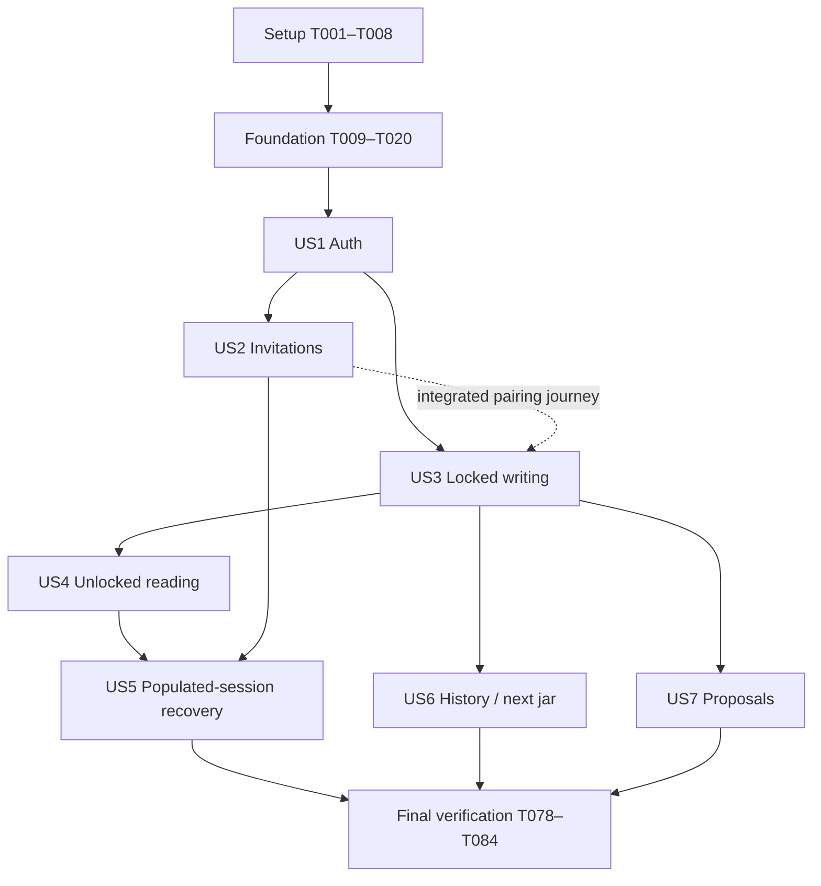

# Tasks: Responsive Good Thing Jar Web Frontend

**Branch**: `002-responsive-web-frontend` | **Date**: 2026-10-01
**Input**: Design documents in `C:\workspace\good-thing-jar\good-thing-jar-spec\specs\002-responsive-web-frontend`
**Prerequisites**: [plan.md](plan.md), [spec.md](spec.md), [research.md](research.md),
[data-model.md](data-model.md), [frontend interface contract](contracts/frontend-interface.md),
[quickstart.md](quickstart.md), and constitution v1.1.0.
**Status**: Generated checklist; no implementation or verification task has been executed.

## Format and Execution Rules

Each task has a sequential ID and exact target file paths. `[P]` permits parallel work only after
the prerequisite phase is complete, and only with the other independent tasks described below.
Story labels map to specification US1–US7. Test tasks define observable outcomes before implementation;
run them and fix failures before the story checkpoint, not while dependencies are still missing.

- Specification paths beginning `specs/` are rooted at
  `C:\workspace\good-thing-jar\good-thing-jar-spec`.
- Implementation paths beginning `../good-thing-jar-front-end/` resolve to
  `C:\workspace\good-thing-jar\good-thing-jar-front-end` (frontend working directory).
- Existing backend test paths beginning `../good-thing-jar-backend/` resolve to
  `C:\workspace\good-thing-jar\good-thing-jar-backend` (backend working directory).
- Run npm, Vite, type checking, linting, frontend builds/tests and frontend source generation from
  the frontend working directory. Run Maven, Compose and backend startup from the backend directory.
- Preserve canonical `specs/001-shared-locked-jar/contracts/openapi.yaml` and existing backend/email
  behavior. No backend production files, migrations, public test endpoints, `/me`, email links,
  idempotency guarantees or token grace periods are added by these tasks.
- Every story must cover all its acceptance scenarios at 1280×800 and 390×844. Cross-cutting checks
  add 320 CSS pixels, 200% zoom and keyboard-only operation; relevant automated tests and actual
  backend checks are required. Test seeds/transport faults are explicitly identified.
- Keep tokens, passwords, email secrets, entry content and sensitive payloads out of logs, reports,
  analytics, URLs and persisted caches/artifacts. MSW is test-only. All private application state
  is memory-only; SC-009's usability trial is deferred and does not block completion.
- Each run task records actual results in `specs/002-responsive-web-frontend/verification.md`;
  never mark a checkbox based on a mocked result when it requires actual backend evidence.

## Phase 1: Setup

**Purpose**: Bootstrap the requested stack and reproducible tooling in the separate frontend root.

- [ ] T001 Bootstrap the React/Vite application with Node 24 LTS and npm, verify compatible stable engines/peer ranges, pin selected dependencies (React Router, TanStack Query, Temporal polyfill and planned test tools), and define quickstart scripts in ../good-thing-jar-front-end/package.json and ../good-thing-jar-front-end/package-lock.json; create strict app/test TypeScript configurations in ../good-thing-jar-front-end/tsconfig.json and ../good-thing-jar-front-end/tsconfig.app.json.
- [ ] T002 [P] Configure ESLint with React hooks/TypeScript rules and zero-warning lint command in ../good-thing-jar-front-end/eslint.config.js; add secret/build/test-output exclusions to ../good-thing-jar-front-end/.gitignore without excluding package-lock.json.
- [ ] T003 [P] Configure Vite development and local preview proxies retaining /api/v1 to http://localhost:8080, CSS Modules, and production exclusion of mock code in ../good-thing-jar-front-end/vite.config.ts; document same-origin production routing in ../good-thing-jar-front-end/README.md.
- [ ] T004 [P] Configure Vitest, RTL, DOM matchers and MSW with unexpected requests failing safely in ../good-thing-jar-front-end/vitest.config.ts, ../good-thing-jar-front-end/src/test/setup.ts and ../good-thing-jar-front-end/src/test/msw/server.ts; ensure test configuration is included by type checking.
- [ ] T005 [P] Configure mock-desktop/mock-mobile and backend-desktop/backend-mobile projects, required viewports, production-preview backend suite and a separate explicitly opted-in MSW test build in ../good-thing-jar-front-end/playwright.config.ts and ../good-thing-jar-front-end/tests/e2e/mocked/bootstrap.ts; disable private trace/video/screenshot/storageState/body artifacts, redact payload assertions, and install required Playwright browsers from the frontend root.
- [ ] T006 [P] Establish the React entry point, Vietnamese document language, responsive warm minimal CSS tokens, focus styling and wrapping defaults in ../good-thing-jar-front-end/index.html, ../good-thing-jar-front-end/src/main.tsx and ../good-thing-jar-front-end/src/app/global.css.
- [ ] T007 [P] Implement Node-only pg fixture and Mailpit helpers that allowlist the disposable E2E database/host, require explicit fixture opt-in, tag synthetic runs, clean up only their records, and extract actual emailed tokens/IDs in memory without logging in ../good-thing-jar-front-end/tests/e2e/fixtures/database.ts and ../good-thing-jar-front-end/tests/e2e/fixtures/mailpit.ts; keep database credentials outside VITE_* and browser imports.
- [ ] T008 Initialize the frontend Git repository if absent and commit bootstrap package.json/package-lock.json plus their required configuration in ../good-thing-jar-front-end/package.json and ../good-thing-jar-front-end/package-lock.json; record exact Node/npm/package versions and the bootstrap commit in specs/002-responsive-web-frontend/verification.md, preserving existing specification-repository changes.

**Checkpoint**: Setup artifacts and lockfile exist in the frontend root; subsequent installs use npm ci.

## Phase 2: Foundational Prerequisites

**Purpose**: Establish safe API/session/query boundaries before any private story relies on them.
All story phases depend on completion of T009–T020, including passing foundational behavior tests.

- [ ] T009 [P] Define transport behavior tests for relative /api/v1 paths, public versus bearer requests, no-store fetch, empty 204, safe Problem translation, malformed DTOs, cancelled/stale completions and no automatic mutation retries in ../good-thing-jar-front-end/src/shared/api/http.test.ts.
- [ ] T010 [P] Define session behavior tests for concurrent protected 401s sharing one refresh, stale-revision 401 suppression, refresh 200/401/429/uncertainty, single GET recovery budget, no POST/DELETE replay, and logout while refresh is pending in ../good-thing-jar-front-end/src/shared/session/renewalCoordinator.test.ts.
- [ ] T011 Implement the raw fetch boundary, narrow Problem/response guards, safe Vietnamese error mapping, empty-response handling and sanitized client outcomes in ../good-thing-jar-front-end/src/shared/api/http.ts and ../good-thing-jar-front-end/src/shared/api/problems.ts; never store/log request or response bodies in errors.
- [ ] T012 Implement shared operation-family Retry-After parsing/cooldowns with monotonic deadlines, early-attempt suppression and explicit manual recovery, including invalid-header safe handling, in ../good-thing-jar-front-end/src/shared/api/cooldown.ts and ../good-thing-jar-front-end/src/shared/api/cooldown.test.ts.
- [ ] T013 Implement memory-only session generation, credential revisions, atomic token-pair replacement, recovery state and request registration in ../good-thing-jar-front-end/src/shared/session/sessionStore.ts and ../good-thing-jar-front-end/src/shared/session/types.ts; do not cache token responses, decode opaque tokens or share tokens across tabs.
- [ ] T014 Implement one synchronously installed shared refresh promise with injected raw refresh/revocation callbacks, generic rejection cleanup, shared 429 cooldown, uncertainty blocking and generation-guarded completion in ../good-thing-jar-front-end/src/shared/session/renewalCoordinator.ts; preserve original refresh expiry and backend rotation/reuse rules.
- [ ] T015 Implement protected request coordination with captured generation/revision, consumed AbortSignal, at most one safe GET replay after confirmed renewal, paused recovery after another 401, and zero automatic mutation replay in ../good-thing-jar-front-end/src/shared/api/protectedRequest.ts.
- [ ] T016 Implement per-session private QueryClient creation with retries/focus/reconnect polling disabled and no offline mutation queue, plus immediate teardown that invalidates generation before cancelling/aborting and clearing both query and mutation caches and registered private state in ../good-thing-jar-front-end/src/shared/session/privateQueryClient.ts and ../good-thing-jar-front-end/src/shared/session/terminateSession.ts; keep best-effort logout revocation separate from aborted private work.
- [ ] T017 Wire session providers, fresh QueryClient ownership, private route guards, session replacement and page lifecycle/back-history protection in ../good-thing-jar-front-end/src/app/providers.tsx and ../good-thing-jar-front-end/src/app/routes.tsx; reset private UI/forms before a new account can appear and never grant authorization from routes or browser expiry estimates.
- [ ] T018 [P] Implement reusable semantic labeled fields, linked errors, visible focus, Vietnamese loading/empty/error/pending announcements and accessible recovery controls in ../good-thing-jar-front-end/src/shared/ui/FormField.tsx, ../good-thing-jar-front-end/src/shared/ui/StatusMessage.tsx and ../good-thing-jar-front-end/src/shared/ui/StatusMessage.module.css.
- [ ] T019 [P] Implement fixed-zone vi-VN instant formatting and display-only countdown helpers with safe invalid-date handling in ../good-thing-jar-front-end/src/shared/time/format.ts and ../good-thing-jar-front-end/src/shared/time/format.test.ts; never derive server authorization or terminal session state from local time.
- [ ] T020 Run T009/T010/T012/T019 behavior tests from the frontend root, correct observed failures in ../good-thing-jar-front-end/src/shared/api/http.ts and ../good-thing-jar-front-end/src/shared/session/renewalCoordinator.ts as needed, and record actual foundational results in specs/002-responsive-web-frontend/verification.md before enabling private journeys.

**Checkpoint**: Safe transport, coordinated renewal and termination/query cleanup are functioning;
later US5 extends end-to-end recovery coverage rather than postponing these prerequisites.

## Phase 3: US1 — Register, Verify and Sign In (P1)

**Goal**: Manual emailed-token verification, generic replacement acknowledgement, sign-in and sign-out.
**Independent test**: Use a synthetic new account and actual current/superseded emails to register,
verify, resend, sign in and sign out on both layouts, including invalid/unverified/generic failures.

### Required Tests

- [ ] T021 [P] [US1] Define MSW adapter tests matching existing registration, verification, resend, sign-in, refresh and logout bodies/statuses, including actual existing sign-in 403 tolerance, 429 handling and empty 204, in ../good-thing-jar-front-end/src/features/auth/api/authApi.test.ts; cover current-pair 200/404 and two-member DTO guarding in ../good-thing-jar-front-end/src/shared/api/pairsApi.test.ts.
- [ ] T022 [P] [US1] Define RTL form tests for email ≤320, signup password 12–128 versus sign-in 1–128, token 32–512, generic resend across account states, non-echoed secrets and keyboard-accessible pending/errors in ../good-thing-jar-front-end/src/features/auth/presentation/AuthPages.test.tsx.

### Implementation and Verification

- [ ] T023 [US1] Implement guarded auth DTOs and existing public registration/verification/resend/session/refresh plus captured-bearer revocation operations in ../good-thing-jar-front-end/src/features/auth/api/authApi.ts; wire raw callbacks into the session coordinator without circular feature/transport dependencies.
- [ ] T024 [US1] Implement auth application flows with attempt IDs, generic results, no token Query cache, no registration-as-sign-in assumption, latest-token guidance, and immediate local logout even when revocation is unconfirmed in ../good-thing-jar-front-end/src/features/auth/application/useAuthFlows.ts.
- [ ] T025 [US1] Implement responsive Vietnamese registration, manual verification/replacement, sign-in and sign-out presentation with semantic labels and distinct interaction states in ../good-thing-jar-front-end/src/features/auth/presentation/AuthPages.tsx and ../good-thing-jar-front-end/src/features/auth/presentation/AuthPages.module.css.
- [ ] T026 [US1] Implement GET /pairs/current and shared PairResponse guards in ../good-thing-jar-front-end/src/shared/api/pairsApi.ts, then connect /register, /verify-email and /sign-in, safe post-sign-in navigation and backend-confirmed pair lookup in ../good-thing-jar-front-end/src/app/routes.tsx and ../good-thing-jar-front-end/src/features/auth/application/useLandingState.ts; use neutral onboarding on protected pair 404, no /me or token decoding, and no fetch inside application/UI code.
- [ ] T027 [US1] Add all US1 browser scenarios at both layouts, actual Mailpit token entry/replacement and generic sign-in/resend outcomes, plus mocked invalid/expired responses, in ../good-thing-jar-front-end/tests/e2e/backend/auth.spec.ts and ../good-thing-jar-front-end/tests/e2e/mocked/auth.spec.ts; never assume clickable email links.
- [ ] T028 [US1] Run relevant auth Vitest/RTL and both-layout browser scenarios from the frontend root with the real backend started from its own root per quickstart; record scenario IDs, environment and results in specs/002-responsive-web-frontend/verification.md and resolve failures before the US1 checkpoint.

**Checkpoint**: Auth slice works independently. US1 is the first demonstrable increment, not the
complete account-to-reveal prototype or full-feature acceptance.

## Phase 4: US2 — Invite and Accept a Reviewed Invitation (P1)

**Goal**: Explicit zone selection, incoming/outgoing status, ID-based review, cancel and delivery retry.
**Independent test**: Two verified unpaired users and an unrelated account exercise emailed-ID
review/acceptance, all delivery/terminal states, eligibility and races in both layouts.

### Required Tests

- [ ] T029 [P] [US2] Define invitation adapter tests for direction lists, optional counterpart email, all seven statuses, empty cancellation, same-ID delivery retry and privacy-safe conflicts/404 in ../good-thing-jar-front-end/src/features/invitations/api/invitationsApi.test.ts.
- [ ] T030 [P] [US2] Define RTL interaction tests for explicit valid zone selection, pending-versus-delivered labels, review-before-accept, accessible pasted-ID matching, distinct list error/empty states and eligible controls in ../good-thing-jar-front-end/src/features/invitations/presentation/InvitationPages.test.tsx.

### Implementation and Verification

- [ ] T031 [US2] Implement InvitationSummary guards and existing create/list/accept/cancel/retry operations in ../good-thing-jar-front-end/src/features/invitations/api/invitationsApi.ts, reusing T026 shared PairResponse guards for acceptance; retain prefix, direction, original expiry and safe outcomes without an individual invitation GET.
- [ ] T032 [US2] Implement incoming/outgoing queries and explicit mutation flows, cooldown/pending suppression, backend reconciliation after races, and pair/jar/invitation invalidation after acceptance in ../good-thing-jar-front-end/src/features/invitations/application/useInvitationFlows.ts.
- [ ] T033 [US2] Implement responsive invitation lists, email/zone form, all status labels, optional permitted counterpart display, expiry and review/action controls in ../good-thing-jar-front-end/src/features/invitations/presentation/InvitationPages.tsx and ../good-thing-jar-front-end/src/features/invitations/presentation/InvitationPages.module.css.
- [ ] T034 [US2] Resolve pasted/route invitation IDs only within authenticated lists, show identical safe missing/inaccessible guidance, and wire /invitations and /invitations/:invitationId in ../good-thing-jar-front-end/src/features/invitations/application/selectInvitation.ts and ../good-thing-jar-front-end/src/app/routes.tsx; verify timezone review precedes acceptance.
- [ ] T035 [US2] Add deterministic both-layout status/terminal/late-delivery/pending/validation/network and creation/delivery-retry 429 cooldown scenarios without false empty or success states in ../good-thing-jar-front-end/tests/e2e/mocked/invitations.spec.ts.
- [ ] T036 [US2] Add real-backend actual-email ID review, wrong verified recipient, invite-before-registration, verification/resend without extending invitation expiry, multiple-target/duplicate/self/ineligible conflicts, cancel/accept races, pairing invalidation, seven-day expiry and failed-SMTP/restored explicit retry tests in ../good-thing-jar-front-end/tests/e2e/backend/invitations.spec.ts; serialize the Mailpit-disruption test and assert unchanged ID/expiry.
- [ ] T037 [US2] Run invitation component/adapter and desktop/mobile mocked plus real-backend scenarios from the frontend root; record results and SMTP-disruption isolation in specs/002-responsive-web-frontend/verification.md, using backend-directory Compose commands only in the dedicated environment.

**Checkpoint**: Pairing can be completed without public lookup or email-link capabilities.

## Phase 5: US3 — View the Locked Jar and Collect Private Notes (P1)

**Goal**: Backend-authorized locked writing, exact drafts and generic confirmed success.
**Independent test**: Both partners submit boundary-length text, then exercise rejection, throttling,
uncertain outcomes and unlock/currentness changes; no stored content/count/metadata appears.

### Required Tests

- [ ] T038 [P] [US3] Define draft behavior tests for original-text UTF-16 code-unit counting (JavaScript text.length matching Java String.length()), exact surrounding spaces/line breaks and combining sequences without trimming/normalization, per-jar/session ownership, pending freeze, recovery retention, success/termination clearing, explicit discard and no migration in ../good-thing-jar-front-end/src/features/jars/application/draftStore.test.ts.
- [ ] T039 [P] [US3] Define composer privacy/state tests for empty and nonblank BMP text at 1/5000/5001 UTF-16 units, one supplementary emoji (2), 2500 emoji (5000), those emoji plus one BMP character (5001), 2501 emoji (5002), spaces-only/tabs-and-line-breaks-only rejection per backend @NotBlank, exact valid surrounding whitespace/accents/combining sequences, repeated activation, 204 generic confirmation, 400/429 retention, uncertainty duplicate warning and no locked-entry queries in ../good-thing-jar-front-end/src/features/jars/presentation/EntryComposer.test.tsx.

### Implementation and Verification

- [ ] T040 [US3] Implement JarSummary/JarDetail guards, list/detail reads and empty-204 entry creation in ../good-thing-jar-front-end/src/features/jars/api/jarsApi.ts; distinguish currentness from returned lock status and optional/null pending proposal, with no locked-entry metadata.
- [ ] T041 [US3] Implement memory-only per-session/per-jar draft state, frozen send snapshots and teardown registration in ../good-thing-jar-front-end/src/features/jars/application/draftStore.ts; retain exact recoverable/uncertain drafts, clear confirmed success and remove mutation variables/references.
- [ ] T042 [US3] Implement current jar lookup and guarded submission flow with pending suppression, Retry-After, explicit retry after renewal, unknown-outcome acknowledgement, 409 reconciliation and generation checks in ../good-thing-jar-front-end/src/features/jars/application/useJar.ts and ../good-thing-jar-front-end/src/features/jars/application/useEntrySubmission.ts.
- [ ] T043 [US3] Implement Vietnamese composer, original-input UTF-16 code-unit length guidance, generic success, recoverable/uncertain states and fixed-zone effective-time display in ../good-thing-jar-front-end/src/features/jars/presentation/EntryComposer.tsx, ../good-thing-jar-front-end/src/features/jars/presentation/EntryComposer.module.css and ../good-thing-jar-front-end/src/features/jars/presentation/JarPage.tsx; reject whitespace-only according to backend @NotBlank and preserve valid surrounding spaces/line breaks exactly without trimming/normalization or a broader browser whitespace rule.
- [ ] T044 [US3] Wire / and /jars/:jarId to backend-driven states, route/session isolation, explicit refresh and one guarded countdown-expiry revalidation in ../good-thing-jar-front-end/src/app/routes.tsx and ../good-thing-jar-front-end/src/features/jars/presentation/JarPage.module.css; local clocks never enable writing/reading and jar navigation never silently loses or submits a draft.
- [ ] T045 [US3] Add both-layout real locked-writing checks for nonblank BMP 1/5000-unit boundaries, supplementary emoji at 2/5000/5001/5002 units, empty/spaces-only/tabs-and-line-breaks-only rejection per backend @NotBlank, exact valid surrounding whitespace/combining sequences and stale writes, plus separate deterministic lost-response/400/429/pending tests in ../good-thing-jar-front-end/tests/e2e/backend/writing.spec.ts and ../good-thing-jar-front-end/tests/e2e/mocked/writing.spec.ts; assert no stored content, IDs, authors, times, counts, previews or automatic resend after success/uncertainty.
- [ ] T046 [US3] Run draft/composer and desktop/mobile writing scenarios from the frontend root; record exact blank/non-BMP compatibility outcomes and any unresolved discrepancy in specs/002-responsive-web-frontend/verification.md without changing backend validation or canonical OpenAPI.

**Checkpoint**: Locked private collection works; confirmation retains no stored-entry presentation.

## Phase 6: US4 — Read After Backend-Confirmed Unlock (P1)

**Goal**: Authorized read-only cursor traversal with correct text, author ID and creation time.
**Independent test**: Both partners traverse every seeded entry exactly once, retry interrupted pages,
and deny unrelated/locked reads despite browser clock changes; record exact-boundary evidence layers.

### Required Tests

- [ ] T047 [P] [US4] Define cursor adapter/query tests for limit=100, absent/null nextCursor, hasMore consistency, unchanged failed-page retry, invalid-cursor restart, repeated cursors/duplicate IDs and no fabricated continuation in ../good-thing-jar-front-end/src/features/jars/application/useEntries.test.tsx.
- [ ] T048 [P] [US4] Define RTL locked/unlocked boundary, browser-clock/countdown, 423 cleanup, empty/end/error distinction, plain-text rendering and returned-ID attribution tests in ../good-thing-jar-front-end/src/features/jars/presentation/EntryReader.test.tsx.

### Implementation and Verification

- [ ] T049 [US4] Implement guarded EntryResponse/EntryPage DTOs and existing authorized cursor read operation in ../good-thing-jar-front-end/src/features/jars/api/entriesApi.ts; encode opaque cursor unchanged and require usable continuation when hasMore is true.
- [ ] T050 [US4] Implement session/jar-scoped useInfiniteQuery with confirmed backend-unlock gating, explicit load/retry/restart, one outstanding page request and protocol-error handling in ../good-thing-jar-front-end/src/features/jars/application/useEntries.ts; clear/hide content on 423/404/auth denial without guessing end or skipping pages.
- [ ] T051 [US4] Implement a bounded rendered reading viewport over visited cursor pages, accessible earlier/later/load-more controls, fixed-zone times and wrapped whitespace-preserving plain text in ../good-thing-jar-front-end/src/features/jars/presentation/EntryReader.tsx and ../good-thing-jar-front-end/src/features/jars/presentation/EntryReader.module.css; render account IDs without inferred you/partner labels.
- [ ] T052 [US4] Integrate backend-confirmed unlocked read-only presentation and safe resource/loading/error states in ../good-thing-jar-front-end/src/features/jars/presentation/JarPage.tsx; remove composer/date-change actions for opened jars and never reveal content solely from countdown or route state.
- [ ] T053 [US4] Add both-layout mocked exact-boundary/clock-skew/interrupted-cursor tests and actual-backend before/after-unlock, empty jar, safe unrelated/nonexistent resource and 10,000-entry traversal per partner tests in ../good-thing-jar-front-end/tests/e2e/mocked/reading.spec.ts, ../good-thing-jar-front-end/tests/e2e/backend/reading.spec.ts and ../good-thing-jar-front-end/tests/e2e/fixtures/entries.ts; keep fixture comparison payloads in memory and reports sanitized.
- [ ] T054 [US4] Run reading tests from the frontend root and run .\mvnw.cmd '-Dtest=JarLockBoundaryIntegrationTest' test from the backend root using ../good-thing-jar-backend/src/test/java/com/goodthingjar/jar/JarLockBoundaryIntegrationTest.java; record t−1 ns/exact-t backend proof separately from both-layout mocked responses and actual-server before/after browser results in specs/002-responsive-web-frontend/verification.md.

**Checkpoint**: Reveal is backend-authorized and every accepted entry is reachable through stable pages.

## Phase 7: US5 — Recover Safely From Sessions and Service Problems (P1)

**Goal**: Complete recovery UX and end-to-end proof of foundation security across populated features.
**Independent test**: With loaded entries/invitations and a draft, induce refresh success/rejection/
throttle/uncertainty and delayed responses, terminate, then sign in as another account on both layouts.

### Required Tests

- [ ] T055 [P] [US5] Extend observable coordinator coverage for shared 200/401/429/uncertain outcomes, delayed replaced-token 401, a second recovery GET 401 without loops, lost rotation response, Strict Mode/concurrent triggers and no POST/DELETE replay in ../good-thing-jar-front-end/src/shared/session/renewalCoordinator.test.ts.
- [ ] T056 [P] [US5] Add populated-session teardown tests covering delayed query/refresh/mutation completions, cleared mutation variables/drafts/form secrets, offline reconnect without queues, back-history and new-account isolation in ../good-thing-jar-front-end/src/shared/session/terminateSession.test.tsx.

### Implementation and Verification

- [ ] T057 [US5] Complete UI-facing recovery flow for successful renewal, generic terminal rejection, throttled manual recovery, uncertain sign-in recovery and safe read/resource errors in ../good-thing-jar-front-end/src/shared/session/useRecovery.ts; protected 401 alone must not terminate or imply failed refresh.
- [ ] T058 [US5] Implement keyboard/touch-accessible Vietnamese recovery/cooldown presentation that preserves drafts until actual local termination and makes no unconfirmed remote-revocation claim in ../good-thing-jar-front-end/src/shared/ui/RecoveryBanner.tsx and ../good-thing-jar-front-end/src/shared/ui/RecoveryBanner.module.css.
- [ ] T059 [US5] Integrate recovery visibility, immediate private-view cleanup and safe logout confirmation across app/providers, auth and jars in ../good-thing-jar-front-end/src/app/providers.tsx, ../good-thing-jar-front-end/src/features/auth/application/useAuthFlows.ts and ../good-thing-jar-front-end/src/features/jars/presentation/JarPage.tsx; correct any discovered generation/cache/form race without logging sensitive values.
- [ ] T060 [US5] Add both-layout controlled-fault browser tests for concurrent/stale 401s, shared refresh results, unknown refresh/write outcomes, network-failed logout, cooldown clock changes, offline reconnection and late completions after account replacement in ../good-thing-jar-front-end/tests/e2e/mocked/recovery.spec.ts; assert request counts and absence of automatic mutation/token reuse.
- [ ] T061 [US5] Add actual-backend access-expiry/rotating renewal/revocation/shared-concurrency/429 and deliberate previous-token-reuse checks in isolated synthetic sessions in ../good-thing-jar-front-end/tests/e2e/backend/sessions.spec.ts; capture tokens only in test memory, verify rotated access is denied after reuse, and preserve generic client guidance and draft/cleanup semantics.
- [ ] T062 [US5] Run populated-session recovery/cleanup and both-layout browser suites from the frontend root, plus .\mvnw.cmd '-Dtest=AuthenticationIntegrationTest' test from the backend root using ../good-thing-jar-backend/src/test/java/com/goodthingjar/identity/AuthenticationIntegrationTest.java; record actual rotation/reuse/logout and uncertainty evidence in specs/002-responsive-web-frontend/verification.md.

**Checkpoint**: P1 account-to-reveal journeys and cross-feature recovery pass independently; the
full release still requires US6/US7 and final gates.

## Phase 8: US6 — Previous Jars and Next Collection (P2)

**Goal**: Read-only history and one next current jar after backend-confirmed unlock.
**Independent test**: Seed previous/opened current jars, visit each, race next creation from both
partners on both layouts and verify one new current jar with the backend default time/zone.

### Required Tests

- [ ] T063 [P] [US6] Define history UI tests for sequence/currentness, selected jar state, loading/error/empty distinction, read-only old jars and navigation/draft protection in ../good-thing-jar-front-end/src/features/jars/presentation/JarHistory.test.tsx.
- [ ] T064 [P] [US6] Define next-jar flow tests for unlocked-current eligibility, pending suppression, 201 result, 409 single-winner reconciliation and no uncertain/renewal replay in ../good-thing-jar-front-end/src/features/jars/application/useNextJar.test.tsx.

### Implementation and Verification

- [ ] T065 [US6] Implement existing POST /jars with guarded JarSummary result and safe conflicts in ../good-thing-jar-front-end/src/features/jars/api/nextJarApi.ts; use no locally invented unlock default or additional creation parameters.
- [ ] T066 [US6] Implement history selection and guarded next-jar flow with shared list/detail invalidation, backend-result currentness and retained per-jar drafts in ../good-thing-jar-front-end/src/features/jars/application/useNextJar.ts.
- [ ] T067 [US6] Implement responsive history/next-collection controls and wire /jars navigation in ../good-thing-jar-front-end/src/features/jars/presentation/JarHistory.tsx, ../good-thing-jar-front-end/src/features/jars/presentation/JarHistory.module.css and ../good-thing-jar-front-end/src/app/routes.tsx; actions remain labeled and keyboard/touch-reachable.
- [ ] T068 [US6] Add both-layout actual-backend old-jar reads, locked denial and simultaneous partner creation with one new current jar, plus controlled conflict/network/draft-navigation cases in ../good-thing-jar-front-end/tests/e2e/backend/history.spec.ts and ../good-thing-jar-front-end/tests/e2e/mocked/history.spec.ts.
- [ ] T069 [US6] Run history/next-jar component and both-layout browser checks from the frontend root; record default January-1/fixed-zone compatibility and single-winner results in specs/002-responsive-web-frontend/verification.md.

**Checkpoint**: History stays readable and no creation race fabricates an extra jar.

## Phase 9: US7 — Mutually Approve a Future Unlock Time (P2)

**Goal**: Explicit-zone future proposals, unchanged pending effective time and backend-validated roles.
**Independent test**: Propose earlier/later future instants, approve/reject as the other partner,
cancel as proposer, deny wrong roles/stale/expired/opened actions, and handle DST input on both layouts.

### Required Tests

- [ ] T070 [P] [US7] Define existing proposal API/result tests and Temporal conversion tests for fixed-zone dates, invalid overflow, DST gaps/overlaps, explicit offset choice and ISO serialization in ../good-thing-jar-front-end/src/features/jars/api/proposalsApi.test.ts and ../good-thing-jar-front-end/src/shared/time/proposalInstant.test.ts.
- [ ] T071 [P] [US7] Define proposal UI/flow tests for pending-versus-effective times, neutral role explanation/account-ID attribution, one pending proposal, backend-only approval updates and safe wrong-role/stale/expiry errors in ../good-thing-jar-front-end/src/features/jars/presentation/UnlockProposalPanel.test.tsx.

### Implementation and Verification

- [ ] T072 [US7] Implement guarded proposal DTOs and existing create/approval/rejection/cancellation operations in ../good-thing-jar-front-end/src/features/jars/api/proposalsApi.ts; parse approval JarDetail and empty 204 results without introducing caller identity or role capabilities.
- [ ] T073 [US7] Implement Temporal-based fixed-zone local input conversion with gap correction and explicit valid overlap offset choices in ../good-thing-jar-front-end/src/shared/time/proposalInstant.ts; future eligibility remains a backend decision and browser time never authorizes access.
- [ ] T074 [US7] Implement pending-suppressed proposal application flows, safe conflict reconciliation, targeted detail/list invalidation and zero optimistic effective-time/authorization changes in ../good-thing-jar-front-end/src/features/jars/application/useUnlockProposal.ts.
- [ ] T075 [US7] Implement responsive Vietnamese date/offset form, separate effective/proposed times, proposer ID, role-neutral action explanations and accessible interaction states in ../good-thing-jar-front-end/src/features/jars/presentation/UnlockProposalPanel.tsx and ../good-thing-jar-front-end/src/features/jars/presentation/UnlockProposalPanel.module.css.
- [ ] T076 [US7] Integrate proposals only into appropriate backend-confirmed locked jar views in ../good-thing-jar-front-end/src/features/jars/presentation/JarPage.tsx and add both-layout real mutual-consent/one-pending/expiry/conflict/opened checks plus mocked DST/input faults in ../good-thing-jar-front-end/tests/e2e/backend/proposals.spec.ts and ../good-thing-jar-front-end/tests/e2e/mocked/proposals.spec.ts.
- [ ] T077 [US7] Run proposal adapter/time/component and both-layout browser checks from the frontend root; record correct role outcomes, unchanged pending effective instant and browser/Java-zone compatibility in specs/002-responsive-web-frontend/verification.md, keeping identity/API/email additions deferred.

**Checkpoint**: Every required story is implemented and independently verified; final completion gates remain.

## Phase 10: Cross-Cutting Polish and Completion

**Purpose**: Prove the complete release satisfies SC-001–SC-008 and constitution completion gates.

- [ ] T078 [P] Add full-journey responsive/accessibility checks at desktop/mobile plus 320 CSS pixels, 200% zoom, keyboard-only focus/labels/state announcements, long Vietnamese/emoji text and touch/no-hover use in ../good-thing-jar-front-end/tests/e2e/mocked/accessibility.spec.ts; correct affected CSS Modules and controls based on observed failures.
- [ ] T079 [P] Add browser privacy checks for empty localStorage/sessionStorage/IndexedDB/private caches, no sensitive console/errors/analytics/URLs, no production mock/service-worker leakage and no old data after logout/history/delayed completion in ../good-thing-jar-front-end/tests/e2e/backend/privacy.spec.ts; inspect in memory and emit sanitized outcomes only.
- [ ] T080 Audit all FR-001–FR-031 and US1–US7 scenario coverage against actual test IDs, including existing 403/blank-length discrepancies, safe absent/unauthorized resources and excluded capabilities; record the coverage matrix and unresolved issues in specs/002-responsive-web-frontend/verification.md and keep canonical backend contracts unchanged.
- [ ] T081 Run npm ci, npm run typecheck, npm run lint, npm run build, npm test and npm run test:e2e from the frontend root using ../good-thing-jar-front-end/package.json and ../good-thing-jar-front-end/package-lock.json; resolve failures and record exact versions/commands/exit results in specs/002-responsive-web-frontend/verification.md, verifying lockfile tracking and mock-free production output.
- [ ] T082 Run npm run test:e2e:backend from the frontend root against the isolated actual Spring Boot/PostgreSQL/Mailpit environment and verify the full desktop prototype and mobile journeys in actual Chrome/Edge desktop, Chrome Android and Safari iOS; record versions/layouts/scenario IDs and distinguish real devices from Playwright emulation in specs/002-responsive-web-frontend/verification.md.
- [ ] T083 Verify the recorded exact-unlock and authentication evidence from ../good-thing-jar-backend/src/test/java/com/goodthingjar/jar/JarLockBoundaryIntegrationTest.java and ../good-thing-jar-backend/src/test/java/com/goodthingjar/identity/AuthenticationIntegrationTest.java alongside both-layout frontend and real-server checks in specs/002-responsive-web-frontend/verification.md; rerun only if affected changes/failures require it, and do not conflate browser-clock control with backend time or uncertainty with guaranteed retry.
- [ ] T084 Finalize implementation/runtime/proxy/test instructions in ../good-thing-jar-front-end/README.md and specs/002-responsive-web-frontend/quickstart.md, review completion evidence and privacy/scope in specs/002-responsive-web-frontend/verification.md, and mark tasks in specs/002-responsive-web-frontend/tasks.md complete only when their actual gates pass; leave SC-009 explicitly deferred non-blocking.

## Dependencies and Execution Order

### Phase Dependencies

1. T001 first. T002–T007 may proceed together on their separate files after T001; T008 waits for
   bootstrap completion. Fixture helpers can be initialized here; schema-specific seeding belongs
   to the relevant story tests.
2. Foundation: T009/T010 define independent test expectations. T011 → T012/T013 → T014 → T015 →
   T016 → T017. T018 and T019 may proceed independently after setup. T020 waits for all foundational
   implementation/tests. API injection wiring becomes concrete in T023 without reopening security gates.
3. All stories need foundation. Shared real-backend fixture/environment setup T007 is required
   before story browser verification. US1 is first; later story tests may use verified seeded sessions
   rather than rerun registration as part of every independent test.
4. US2 requires US1 sign-in/routing for the integrated journey. US3 requires auth and a paired
   fixture; integrated onboarding also uses US2. US4/US6/US7 require US3 jar DTO/detail/route foundation.
   Their flow-specific implementation/tests may be developed independently with appropriate fixtures.
5. US5 extends foundation plus the populated US1–US4 app for complete cleanup/recovery proof.
   Its test definitions can start after foundation, but its story checkpoint waits for US1–US4.
6. Serialize edits to shared routes/providers/JarPage and all verification.md writes. Parallel
   feature test/API work does not authorize simultaneous shared-file edits or SMTP disruption.
7. Final phase waits for all seven checkpoints. T078/T079 have separate test files; fix overlap in
   shared presentation sequentially. T080 follows coverage creation; T081/T082/T083 complete gates;
   T084 closes documentation and evidence. No task authorizes deployment or changes of feature scope.

### Story Dependency Graph

Within each story, define tests first; implement API/guards, then application flows, then presentation/
integration, then execute relevant automated and real-backend scenarios. `[P]` test-definition tasks
do not depend on the story implementation being available to write expectations; executing them
requires that implementation. Each checkpoint validates an independent story, with named fixture
prerequisites instead of pretending authentication/pairing dependencies do not exist.

## Parallel Execution Examples

| Story | Independent parallel tasks | Prerequisite / shared-write caution |
|---|---|---|
| US1 | T021 auth adapter tests + T022 auth form tests | Foundation complete; separate files |
| US2 | T029 invitation adapter tests + T030 invitation UI tests | Foundation/auth contracts available; separate files |
| US3 | T038 draft tests + T039 composer tests | Foundation/auth and paired fixture; separate files |
| US4 | T047 cursor tests + T048 reader/lock tests | US3 jar interfaces available; separate files |
| US5 | T055 renewal race tests + T056 teardown tests | Foundation; populated-feature execution waits for US1–US4 |
| US6 | T063 history UI tests + T064 next-jar flow tests | US3 jar foundation; separate files |
| US7 | T070 API/time tests + T071 proposal UI tests | US3 jar foundation; separate files |

Setup also permits T002–T007 together after T001, and shared UI/time work T018/T019 is independent
of session implementation files. Browser suites using shared fixture resets or Mailpit failure are
serialized; ordinary independent fixture runs use run-specific data. This is execution guidance,
not a request to spawn agents during task generation.

## Implementation Strategy and Acceptance Mapping

Deliver setup/foundation and US1 first as the auth increment. Then complete US2–US5 for the P1
account-to-reveal prototype, with full desktop usability and mobile parity. Add US6/US7 for the
complete specified release, then run final gates. Do not drop P2 stories from release completion.

| Story | Tasks | Independent outcome | Core requirement coverage |
|---|---|---|---|
| US1 | T021–T028 (8) | Actual emailed-token registration/verification/resend/sign-in/out | FR-001–004; US1.1–7 |
| US2 | T029–T037 (9) | Reviewed emailed-ID pairing and delivery/expiry/race handling | FR-008–012; US2.1–8 |
| US3 | T038–T046 (9) | Exact private draft submission with generic confirmed success/recovery | FR-013–018; US3.1–8 |
| US4 | T047–T054 (8) | Authorized exact-boundary handling and complete cursor reading | FR-014/019–020/027; US4.1–7 |
| US5 | T055–T062 (8) | Shared renewal outcomes and complete private-state cleanup/recovery | FR-005–007/026–027; US5.1–12 |
| US6 | T063–T069 (7) | Read-only history and single next current jar | FR-013/020–021; US6.1–5 |
| US7 | T070–T077 (8) | Mutual consent, correct fixed-zone instant and unchanged pending effective time | FR-022–025; US7.1–7 |

FR-028–FR-030 apply to every story's presentation and both-layout tests plus T078/T082. FR-031
governs all adapters and scope audit T080. Foundation and T079 cover private-data handling across
features. SC-001–SC-008 are completion gates; SC-004's 10,000-entry and exact-boundary evidence are
explicit T053/T054/T083 work, not an assumed test result. SC-009 remains a separate follow-up trial.

**Inventory**: 84 tasks: setup 8, foundation 12, user-story tasks 57, final completion 7.
26 tasks are marked `[P]`. The npm lockfile commitment is explicit T008 work in the frontend
repository, unaffected by disabled auto-commit hooks in the specification repository.
